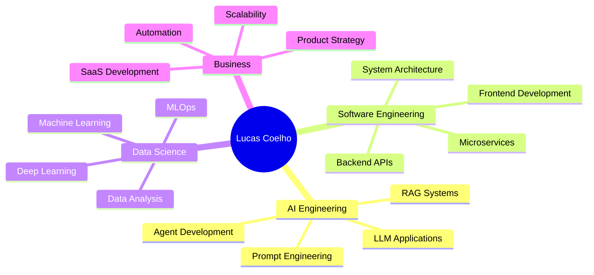

<div align="center">

# 🚀 Lucas Coelho | AI Engineer & Full Stack Developer


[]([https://linkedin.com/in/](https://www.linkedin.com/in/lucas-coelho-ba756318b/))
[](mailto:lukaslopes.coelho@icloud.com)
[](https://instagram.com/coringadev22)
[](https://inteltech.ai)

</div>

---

## 👨‍💻 Sobre Mim

Sou **AI Engineer e Cientista de Dados** especializado em construir soluções escaláveis com **Inteligência Artificial Generativa**. Transformo ideias em produtos reais, combinando **ML Engineering, LLMs e desenvolvimento full-stack** para criar sistemas que geram valor para negócios.

💡 **Do MVP ao produto escalável** — desenvolvimento de agentes inteligentes, APIs robustas, automações conversacionais e dashboards analíticos com foco em **performance e experiência do usuário**.

```python
class LucasCoelho:
    def __init__(self):
        self.role = "AI Engineer & Data Scientist"
        self.location = "Machico, Madeira 🇵🇹"
        self.focus = ["Gen AI", "LLM Engineering", "MLOps", "Full Stack"]
        self.current_project = "Building AI-powered SaaS platforms"
    
    def get_skills(self):
        return {
            "ai_ml": ["GPT-4", "Claude", "LangChain", "LlamaIndex", "RAG Systems"],
            "backend": ["Python", "FastAPI", "Flask", "Node.js", "PostgreSQL"],
            "frontend": ["React", "Next.js", "Streamlit", "TailwindCSS"],
            "cloud_devops": ["Docker", "AWS", "Supabase", "CI/CD"],
            "data": ["Pandas", "NumPy", "Scikit-learn", "TensorFlow", "PyTorch"]
        }
```

---

## 🛠️ Tech Stack

### 🤖 AI & Machine Learning


### 💻 Backend & APIs


### 🎨 Frontend & UI


### ☁️ Cloud & DevOps


### 📊 Data Science


---

## 🚀 Projetos em Destaque

### 🤖 AI & LLM Engineering

<table>
<tr>
<td width="50%">

#### 🧠 IntelTech AI Platform
**Sistema SaaS com IA Generativa**
- Stack: GPT-4, LangChain, FastAPI, React
- RAG system para conhecimento personalizado
- Multi-agente com memória e contexto
- Integração WhatsApp Business API

[🔗 Ver Projeto](#)

</td>
<td width="50%">

#### 💬 AI Chat Agents
**Agentes conversacionais inteligentes**
- Processamento de linguagem natural
- Sistema de intents e entities
- Integração com CRMs e databases
- Deploy em produção com 99.9% uptime

[🔗 Ver Projeto](#)

</td>
</tr>

<tr>
<td width="50%">

#### 🦷 ImplantAI Assistant
**Assistente virtual para clínicas**
- Fine-tuning de modelos especializados
- Sistema de agendamento automatizado
- Knowledge base com embeddings
- Interface conversacional multicanal

[🔗 Ver Projeto](#)

</td>
<td width="50%">

#### 🤖 Bot Barber Pro
**Agente de IA para barbearias**
- Atendimento 24/7 via WhatsApp
- Sistema de agendamento inteligente
- Consulta de preços e serviços
- Pipeline de ML para análise de feedback

[🔗 Ver Projeto](#)

</td>
</tr>
</table>

### 📊 Data Science & Analytics

<table>
<tr>
<td width="50%">

#### 📈 Ilhas Analytics Dashboard
**Business Intelligence em tempo real**
- Stack: Python, Streamlit, PostgreSQL
- KPIs de vendas, CMV e performance
- Visualizações interativas e filtros
- Atualização automática de dados

[🔗 Ver Projeto](#)

</td>
<td width="50%">

#### 🧪 Turnover Prediction Model
**ML para análise de rotatividade**
- Modelo preditivo de churn de funcionários
- Feature engineering avançada
- XGBoost com 87% de acurácia
- Deploy com API REST

[🔗 Ver Projeto](#)

</td>
</tr>
</table>

### 💰 FinTech & Trading

<table>
<tr>
<td width="50%">

#### 💹 CryptoTrader Bot
**Trading algorítmico automatizado**
- Integração Binance API
- Análise técnica com indicadores
- Sistema de risk management
- Backtesting e otimização

[🔗 Ver Projeto](#)

</td>
<td width="50%">

#### 📊 Financial Analytics Suite
**Análise e previsão financeira**
- Time series forecasting
- Portfolio optimization
- Risk assessment models
- Dashboards executivos

[🔗 Ver Projeto](#)

</td>
</tr>
</table>

---

## 📊 GitHub Stats

<div align="center">
  


</div>

---

## 🎯 Áreas de Especialização



---

## 🏆 Competências Core

<div align="center">

| 🤖 Gen AI & LLMs | 💻 Software Engineering | 📊 Data Science |
|:---:|:---:|:---:|
| GPT-4, Claude, Gemini | FastAPI, Flask, Django | Scikit-learn, TensorFlow |
| LangChain, LlamaIndex | React, Next.js, Node.js | Pandas, NumPy, Matplotlib |
| RAG Systems | PostgreSQL, MongoDB | Feature Engineering |
| Fine-tuning | Docker, AWS | Model Deployment |
| Agent Development | REST APIs, GraphQL | A/B Testing |

</div>

---

## 📫 Vamos Conectar?

<div align="center">

Estou sempre aberto a discussões sobre **IA, engenharia de software e oportunidades de colaboração**!

📧 **Email:** lucas@inteltech.ai  
💼 **LinkedIn:** [Lucas Coelho](https://linkedin.com/in/)  
📱 **Instagram:** [@coringadev22](https://instagram.com/coringadev22)  
🌐 **Portfolio:** [inteltech.ai](https://inteltech.ai)

---

### 🎯 Atualmente

- 🔨 Desenvolvendo plataforma SaaS de fidelização digital para barbearias
- 🌱 Aprofundando em **LangGraph** e **Multi-Agent Systems**
- 🤝 Aberto a colaborar em projetos de **Gen AI** e **MLOps**
- 💬 Pergunte-me sobre **LLMs, RAG systems, Python ou Arquitetura de Software**

---


⭐️ **Se você gostou dos meus projetos, considere dar uma estrela!**


</div>
